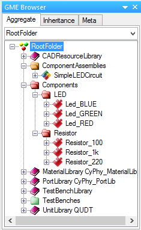
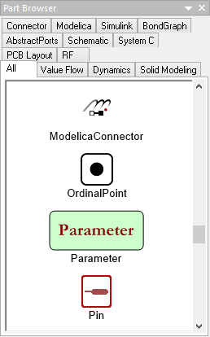
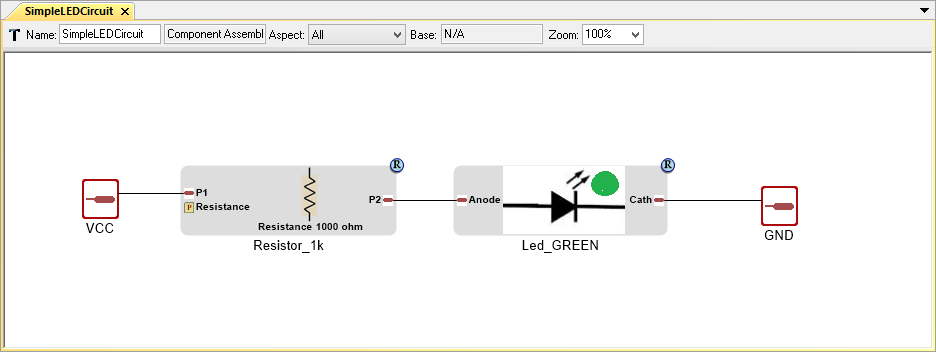

____
## Building a Basic LED Circuit Model
In this first secftion, we'll build a simple LED circuit.  Engineers often use multiple types of analysis software to test their designs.  This practice takes time; you need to learn each piece of software and compose a model for each one that will test for a parameter.
However, Metamorphosys tools allow you to run multiple types of analyses by composing just one model.  

### Creating a New Component Assembly
In the Metamorphosys tools, we build a design by instantiating components and joining their interfaces, yielding a _Component Assembly_.
We call this process _composition_. 
From this composed design, we can generate new models and run analyses.

We begin by connecting our components in a single component assembly. Let's set up our  ***Component Assembly*** by making a new folder and model.

In the **GME Browser** window:
1. Right-click on the ***RootFolder***, and choose **Insert Folder -> Component Assemblies**.
2. Right-click on ***ComponentAssemblies***, and choose **Insert Model -> Component Assembly**. 
3. Rename this new _Component Assembly_ to ***SimpleLEDCircuit***.

<!---->

### Browsing the Component Library

In the **GME Browser** window:

1. Expand the ***RootFolder*** to see the folders in your project.
2. Expand the ***Components*** folder, as well as its subfolders (LED and Resistor), to see the available components.

We have included six components into your project file: three resistors and three LEDs.

### Populate the Component Assembly
Double-clicking on ***SimpleLEDCircuit*** will open a _white canvas_.

To populate a component assembly, the components need to be copied and pasted into the canvas as _references_. There are two ways to do this. We will show you the two different methods as we instantiate the LED and Resistor components. 

#### Instantiate an LED using Method 1:

1. In your **GME Browser**, locate ***Led\_GREEN*** in the ***Components*** folder.
2. Right-click on it and choose **Copy**. 
3. Right-click on your white canvas, and choose **Paste Special -> As Reference**. 

#### Instantiate a resistor using Method 2:

1. In your **GME Browser**, locate ***Resistor\_1k***.
2. **Drag and drop** the resistor onto your white canvas with a **right-click**.
3. Select **Create Reference**. 

_Note: DO NOT drag with left-click. It will remove the component from the components folder.  Undo this with (Ctrl-Z) or select **Edit -> Undo** from the menu._

In the future, you can use whichever method you prefer, since they produce the same result.

<!--  -->

### Joining the Component Interfaces
The flow of current in this simple design will be as follows:
**Voltage Source -> 1k Resistor -> LED -> Ground**

Since we don't have a power source or ground connection yet, we'll start by joining the **1k Resistor -> LED**.

1. Change your cursor to **Connect Mode** by pressing <i>(Ctrl-2)</i>.
2. Click the icon next to ***P2*** of the Resistor.
3. Click the icon next to ***Anode*** of the LED.

_Note: If something goes wrong, you can back track with "undo" (Ctrl-Z) or use **Disconnect Mode** (Ctrl-3)_.

<!--  -->

<!-- The anode is connected to the high-voltage side, while the cathode is connected to the low-voltage side. -->

### Creating External Interfaces
Our circuit is still missing a power source and sink. We must create two external connectors into our circuit: power supply and electrical ground.

#### Create new external connectors for your component assembly
1. Put your cursor in **Edit Mode** by pressing <i>(Ctrl-1)</i>.
2. In the **Part Browser** window on the left side, locate the "Pin" (see the figure below).
3. **Drag and Drop** two **Pins** into your component assembly with **left-click**.
4. Rename the pins to ***VCC*** and ***GND***.

#### Connect external connectors to components
Recall the circuit architecture that we have planned: **Voltage Source -> 1k Resistor -> LED -> Ground**. We'll use the same method as connecting the ports of two components.

1. Return your cursor to **Connect Mode** by pressing <i>(Ctrl-2)</i>.
2. Create a connection from ***VCC*** to ***P1*** of the Resistor.
3. Create a connection from ***GND*** to ***Cath*** of the LED.

<!--  -->

Although we're counting on the power and electrical ground to be provided externally, we've implemented the architecture we proposed at the beginning of the section, **Voltage Source -> LED -> 1k Resistor -> Ground**. Your component assembly should look like the figure.

