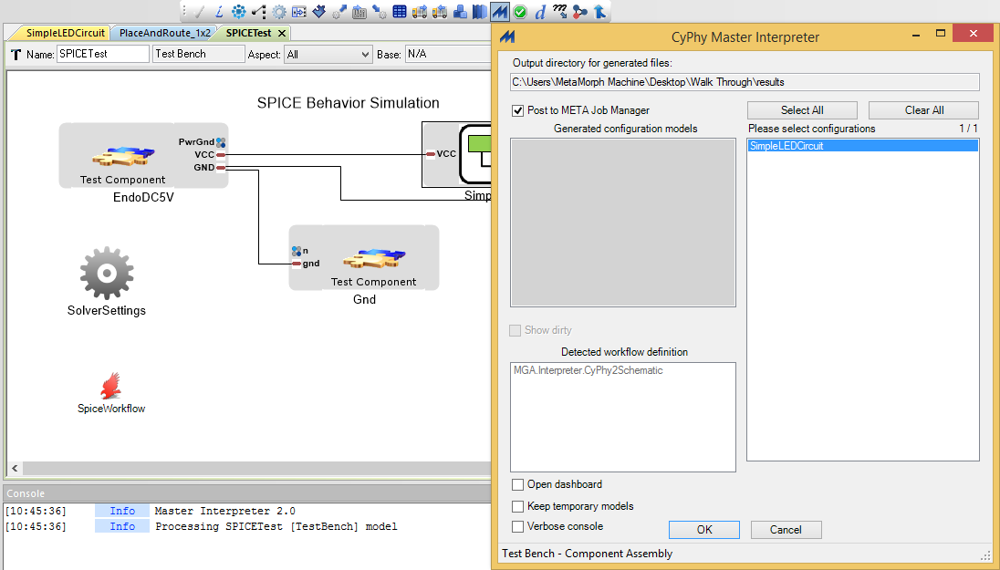

___
## Performing Circuit Analysis
We will perform a circuit analysis via **SPICE**, a circuit simulation software, on our ***SimpleLEDCircuit*** component assembly. 

1. Open up the ***SPICETest*** test bench and create a reference of ***SimpleLEDCircuit*** using the [same method as before](@ref configuring-a-test-bench).
2. Connect the corresponding pins, ***VCC*** and ***GND***, of the ***SimpleLEDCircuit*** to those of the **Test Components**. (Connecting GND to either Test Component will work)

<!--  -->
 
Now we are going to run a simulation that provides 5V DC to ***VCC*** while establishing an electrical ground for ***GND***.

### Generating Results

1. Locate the **Master Interpreter** icon near the top and click it.
2. Make sure **Post to META Job Manager** is _checked_.
3. Click OK.

After a couple seconds, the **META Job Manager** will launch and begin running your simulation. After a few more moments, the new *META Job* listed there should change colors from blue to green. If there is an error, it will turn red.

### Viewing Results in Spice Viewer

1. Once your job successfully completes and turns green, right-click it and select Show in explorer.
2. Double-click the `LaunchSpiceViewer.bat` file.

As you can see, this circuit draws about **23.5 milliWatts** of power with about **4.5 milliAmps** of current.