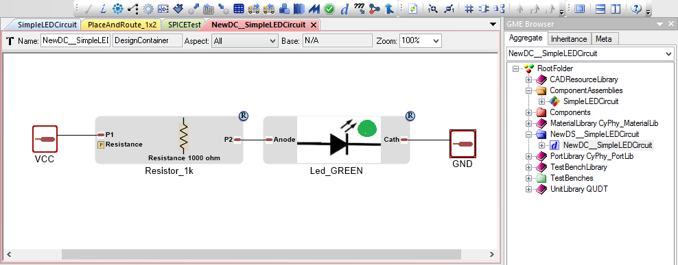
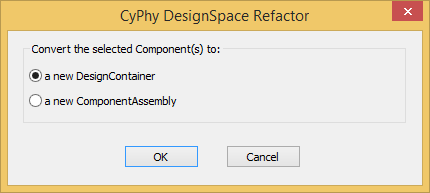
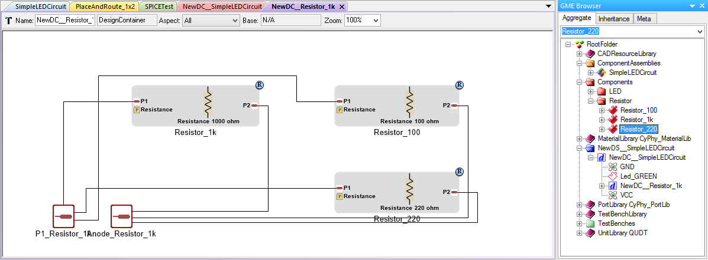

____
## Adding Design Space Concepts
<!--
###THIRD VIDEO:
1. Do everything from here until the end. 
2. "you've just completed the tutorial on meta tools"
3. RECAP - created a component assembly out of components, performed simulations, converted our component assembly into a design space, ran multiple simulations at once.
-->

So far, we constructed a simple LED circuit consisting of a _single_ LED and a _single_ resistor. In the META tools, this is referred to as a _Design Point_. 
In this section, we'll modify our simple LED circuit to use a selection of resistors and LEDs in our design by creating a _Design Space_.

This section of the tuturial builds upon the previous sections, so you'll need to use the model that you built. Alternatively, you can open `Walkthrough_LED_part2.xme`, which includes all of the work from the previous sections.

### Refactoring a Design Point into a Design Space
We must first convert our _component assembly_ to a _design container_ and then convert each _component_ into a _design container_.

1. Open up ***SimpleLEDCircuit*** and make sure nothing in the canvas is selected.
2. Click the **Design Space Refractorer** icon (3 blue colored boxes).
3. Go to the **GME Browser** Window and locate and expand the blue ***NewDS\_\_SimpleLEDCircuit*** folder.
4. Double-click ***NewDC\_\_SimpleLEDCircuit*** to open it.

You'll notice that it looks _exactly_ like your previous component assembly. 
It has preserved the component names, port names, connections, and layout. However, since we now have a design container, we can begin adding variability to the design space.

### Convert Component into Alternative

Starting with the 1k resistor:

1. Select ***Resistor\_1k***.
2. Click the **Design Space Refactorer** tool, again.
3. When prompted, choose to convert the selected Component to a new **DesignContainer**.
   
4. Double-click the new **Design Container** that replaced your 1k resistor.
5. Drag in references of the other two resistors from the **Components** folder. [see Method 1 or 2 above](@ref populate-the-component-assembly)
6. Mimic the connections of ***Resistor\_1k*** so that each resistor in the design space matches the paradigm: **P1_Resistor_1k -> resistor_X -> Anode_Resistor_1k**

Go back to ***NewDC\_\_SimpleLEDCircuit*** and repeat steps 1-6 for ***Led\_GREEN*** by creating references of the other two LEDs, Blue and Red, inside the design container.  When you are done, it should look like this:

### Generating Design Points
Since we have three alternative resistors and three alternative LEDs, we can select up to nine configurations.

1. Select the **Design Space Exploration Tool**. (Blue letter 'd' on the toolbar)
2. Click _Show CFGs_.
3. Verify that there are nine configurations and select _Export All_. 
4. Click _Return to CyPhy_.

It won't look like anything happened but there will be nine simulations (one for each **Design Point**) the next time you run a test bench.
