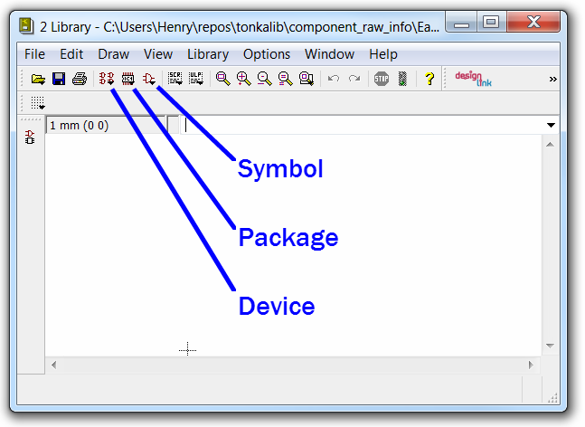
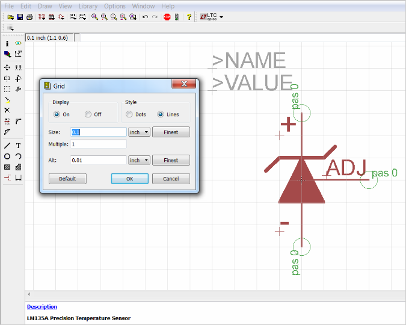
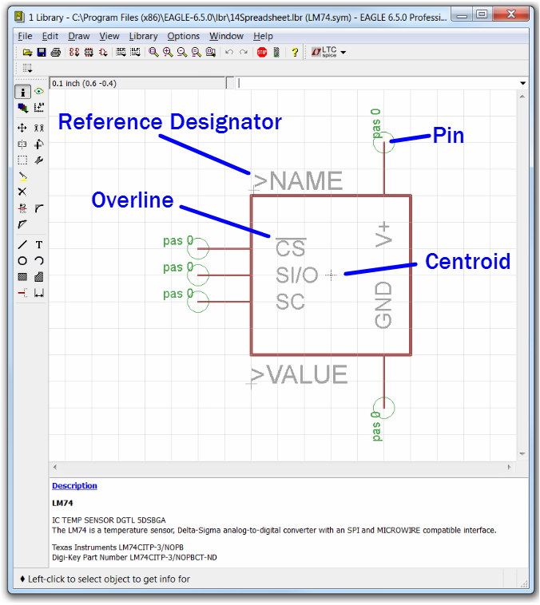
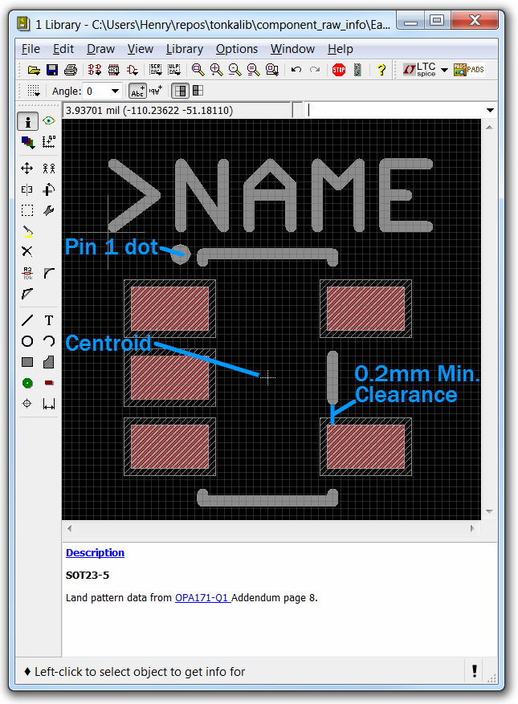

___
## Modeling Guidelines: Eagle Devices

### Introduction to Eagle Devices modeling guidelines

**EAGLE** (Easily Applicable Graphical Layout Editor, German: Einfach anzuwendender grafischer Layout-Editor) is a PCB-design software application by CadSoft that is used by the CyPhy modeling environment.

**EAGLE Devices** are electrical parts as found in an Eagle component library.  Each EAGLE device has associated with it a schematic **symbol**, a PCB footprint called a **package**, and other information such as the mapping between the pins of the symbol and the pads of the package.

####Purpose
One of the prerequisites for making a CyPhy component model is having an Eagle device for the component.  If you can't find the Eagle device you want in a pre-existing library, you may need to make one. To help, this subchapter attempts to provide some tips and summarize best practices for modeling devices in Eagle.

####Subsection Organization

The EAGLE library presents three different editing views:
1. Edit a Symbol -- Used to design the schematic symbol, indicating schematic pins;
2. Edit a Package -- Used to design the PCB footprint, including SMD lands, through-hole pads, and silk screens;
3. Edit a Device -- Used to name and describe the device, select the symbol and package associated with the device, and map symbol pins to package pads.

The icons used to switch between these views is shown in the figure below.

<i>EAGLE 6.5.0 library action-toolbar icons that select either the symbol, package, or device editing modes.</i>

The remainder of this subchapter is organized into three sections, providing guidelines corresponding to each of those three editing views.

### Editing a symbol

* The grid display should be on and set to 0.1 inch.  All pins must be on the 0.1 inch grid, to enable them to be easily connected on schematics.

<i>The EAGLE grid settings used to display 0.1 inch grid lines in the symbol editor.</i>

* The "direction" of all pins should be "pas" (passive), to keep things simple and avoid undesired side effects.
* Each symbol should have a ">NAME" text, on layer 95 ("Names"). This text is a placeholder for the component reference designator, such as "R2", that will appear when the symbol is used in a schematic.
* Each symbol should have a ">VALUE" text, on layer 96 ("Values").
* The preferred height of the ">NAME" and ">VALUE" texts is 0.07 inches, and the preferred font is "proportional".
* The symbol's centroid, shown as a dotted-line "+" symbol, should be at the center of the symbol.  (This is the handle that will select the part when editing a schematic.)
* Pin naming should generally follow the pin names used on the manufacturer's data sheet.
* An exclamation point ("!") in the text of a pin name will toggle the display of an overline above the following text.  The overline may be used, for instance, to identify negative-logic signals.
* In Eagle 6.5, it is not possible to manually adjust the position of a pin's name relative to the pin.  If a pin-name's position is inappropriate, it can be hidden, and normal text added to look like the pin's name, using layer 94 (Symbols).
* For polarized parts such as electrolytic capacitors, name the pins for their polarity, e.g. "POS" and "NEG".  For diodes, it is better to name the pins as "A" (for anode) and "C" (for cathode), than "POS" and "NEG", since diode polarity is subject to interpretation based on a circuit's function.
* For non-polarized components with two pins, the pins can be named "1" and "2", with pin "1" on the left.

<i>Symbol view in EAGLE library editor, showing a passive pin, the centroid, an overlined pin name, and a placeholder for the reference designator.</i>

### Editing a package

Eagle defines a **package** as a component footprint stored in a library.  The term **footprint** refers to the physical layout that is required on the printed circuit board in order to mount a component.

Editing a package consists of two parts:
1. Designing or finding an appropriate package footprint, and
2. Drawing the corresponding patterns on the appropriate Eagle CAD "layers".

Each of these is described in more detail below.

#### Designing or finding an appropriate package footprint
Mathematically designing a PCB land pattern for a surface-mount component is perhaps the most complicated step that may be needed in designing an Eagle device, involving fabrication, assembly, and component tolerances. How to do this is properly beyond the scope of this guideline. However, manufacturers often provide suggested footprints for their components, either near the end of a datasheet, or otherwise available online.  And, sometimes a package can be reused from a similar component.

#### Drawing footprint patterns on EAGLE layers

EAGLE allows 2-D graphics to be drawn on EAGLE layers, that will eventually be processed to create files useful for automated PCB fabrication and assembly.  These EAGLE layers are related to but not necessarily the same as PCB layers, sine multiple EAGLE CAD layers may be combined to form a tooling file for a single PCB layer. The most common output file format is extended Gerber format, which contains a vector-graphic represention of photolithographic artwork. The following table gives an example of how EAGLE layers might be combined to form Gerber files.
(This example is for a two-layer PCB
using a both through-hole and SMT components, with components and silk screen only on the top side.)

| Gerber file description | Eagle layer numbers | Eagle layer names |
|:-----------------------:|:--------------------|:------------------|
| Top Solder Paste        | 31                  | tCream            |
| Top Silk Screen         | 20, 21, 25          | Dimension, tPlace, tNames |
| Top Solder Mask         | 29                  | tStop             |
| Component Side          | 1, 17, 18           | Top, Pads, Vias   |
| Solder Side             | 16, 17, 18          | Bottom, Pads, Vias|
| Bottom Solder Mask      | 30                  | bStop             |
| Board Outline           | 20, 46              | Dimension, Milling|
| Top Assembly Drawing    | 20, 21, 25, 51      | Dimension, tPlace, tNames, tDocu |

In addition, layers 44 and 45 (Drills and Holes) may be combined to form an CNC drilling file, typically in "Excellon" format.

The following table lists the EAGLE package editor layers, with suggestions for how they may be used when creating top-side devices.  (There is no need to design separate bottom-of-board components, since EAGLE has a *mirror* tool to flip them.)

| Layer # | Name   | Eagle Desc.      | Suggested Device Usage |
|:-------:|:-------|:-----------------|:-----------------------|
|1        | Top    | Tracks, top side | SMD lands.  Might draw arbitrarily-shaped lands as polygons. |
|2        | Route2 | Inner layer      | *Unused*                 |
| 3       | Route3 | Inner layer      | *Unused*                 |
| 4       | Route4 | Inner layer      | *Unused*                 |
| 5 | Route5 | Inner layer | *Unused* |
| 6 | Route6 | Inner layer | *Unused* |
| 7 | Route7 | Inner layer | *Unused* |
| 8 | Route8 | Inner layer | *Unused* |
| 9 | Route9 | Inner layer | *Unused* |
|10 | Route10 | Inner layer | *Unused* |
|11 | Route11 | Inner layer | *Unused* |
|12 | Route12 | Inner layer | *Unused* |
|13 | Route13 | Inner layer | *Unused* |
|14 | Route14 | Inner layer | *Unused* |
|15 | Route15 | Inner layer | *Unused* |
|16 | Bottom | Tracks, bottom side | Might create bottom-side thermal lands for QFNs, as drawn polygons. |
|17 | Pads | Pads (through-hole) | The copper part of though-hole pads. Not used for SMD. |
|18 | Vias | Vias (through all layers) | The copper part of vias.  Might connect thermal QFN lands drawn on both sides of a board. |
|19 | Unrouted | Airlines (rubber bands) | *Unused* |
|20 | Dimension | Board outlines (circles for holes)  | *Unused* |
|21 | tPlace | Silk screen, top side | Top silk screen |
|22 | bPlace | Silk screen, bottom side | *Unused* |
|23 | tOrigins | Origins, top side (generated autom.) | Centroids for automated SMT pick and place. |
|24 | bOrigins | Origins, bottom side (generated autom.) | *Unused* |
|25 | tNames | Service print, top side (component NAME) | ">NAME" text in the device becomes a component reference designator, such as "R1". |
|26 | bNames | Service print, bottom s. (component NAME) | *Unused* |
|27 | tValues | Component VALUE, top side | *Unused* |
|28 | bValues | Component VALUE, bottom side | *Unused* |
|29 | tStop | Solder stop mask, top side (gen. autom.) | Typically automatically generated from design rules, can be manually overridden. |
|30 | bStop | Solder stop mask, bottom side (gen. Autom.) | *Unused* |
|31 | tCream | Solder cream, top side | Typically automatically generated from design rules, can be manually overridden. |
|32 | bCream | Solder cream, bottom side | *Unused* |
|33 | tFinish | Finish, top side | *Unused* |
|34 | bFinish | Finish, bottom side | *Unused* |
|35 | tGlue | Glue mask, top side | *Unused* |
|36 | bGlue | Glue mask, bottom side | *Unused* |
|37 | tTest | Test and adjustment information, top side | *Unused* |
|38 | bTest | Test and adjustment inf., bottom side | *Unused* |
|39 | tKeepout | Restricted areas for components, top side | Used to provide more component clearance. |
|40 | bKeepout | Restricted areas for components, bottom s. | *Unused* |
|41 | tRestrict | Restricted areas for copper, top side | Prevent shorts with nearby metallic objects. |
|42 | bRestrict | Restricted areas for copper, bottom side | Prevent shorts with nearby metallic objects. |
|43 | vRestrict | Restricted areas for vias | *Unused* |
|44 | Drills | Conducting through-holes | The holes of vias and through-hole pads. |
|45 | Holes | Non-conducting holes | Mounting and reference-holes. |
|46 | Milling | Milling | Component mounting tabs |
|47 | Measures | Measures | *Unused* |
|48 | Document | Documentation | *Unused* |
|49 | Reference | Reference marks | *Unused* |
|51 | tDocu | Detailed top screen print | Possibly additional info for assembly drawings. |
|52 | bDocu | Detailed bottom screen print | *Unused* |

#####Device Orientation
Automated SMD pick-and-place machines need to be programmed with the location of part centroids and part rotations.  The orientation of devices in the package editor should follow the following guidelines to aid automated PCB assembly. In the descriptions, components are viewed from the top side, and the plane of the editing monitor is assumed to be vertical.

* For symmetrical parts, the centroid (as seen as a "+" on layer 23, "tOrigins") shall be located at the center.
* For asymmetrical parts, it is suggested that the centroid be located vertically halfway between the highest and lowest pins, and horizontally halfway between the leftmost and rightmost pins.
* For two-pin components, such as chip resistors, inductors, and capacitors, the lands should be arranged horizontally, with pin 1 (positive pin) on the left.  For diodes, the cathode (pin "C") is on the left.
* For parts with two rows of pins, the device shall be oriented so that the two rows of pins are vertical, with pin 1 in the upper left.
* For devices with four rows of pins along the sides of a rectangle, and pin 1 at the end of a row, the device shall be oriented so that pin 1 is at the upper left.
* For devices with four rows of pins along the sides of a rectangle, and pin 1 near the center of a row, the device shall be oriented so that pin 1 is near the top center.
* Rectangular BGAs shall be oriented so that pin A1 is in the upper left.

See also: http://ohm.bu.edu/~pbohn/__Engineering_Reference/pcb_layout/pcbmatrix/Component%20Zero%20Orientations%20for%20CAD%20Libraries.pdf

#####Silkscreens
In general, silkscreen artwork:
- should not be placed over copper pads and lands,
- should avoid excessively tiny text, and
- should allow for registration tolerances.

The minimum allowed width of silkscreen lines, and the registration tolerances of the silkscreen relative to the board, vary depending on the PCB manufacturer.  Based on the capabilities of a few representative PCB manufacturers, the following guidelines are suggested:
* All of a component's printable silkscreen for the top side of the PCB should appear on EAGLE layer 21 ("tPlace"), except for the component reference designator, which will be indicated via the placeholder text ">NAME" on Eagle layer 25 ("tNames").
* For components that may be two small to have printed silkscreen outlines, component outlines may be added to EAGLE layer 51 ("tDocu"), for component assembly drawings.
* There should be a minimum of 0.2 mm clearance between silkscreen ink and copper lands.
* The minimum silkscreen line width should be 6 mils (~0.15 mm).
* The font for silkscreen text shall be "vector".
* The minimum size of silkscreen text shall be 40 mils (~1.0 mm), with a "ratio" setting of 15%.
* Silkscreen part outlines should be designed so they are visible when the part is placed.
* Pin 1 of ICs should be indicated with a dot on layer 21.  This dot should be a circle with a line width of 6 mils and a radius of 2.5 mils.
* The positive pin of electrolytic capacitors should be indicated with a "+".
* The cathode of diodes should be indicated in the silkscreen with at least a dot. Preferably, if space permits, there should also be a correctly-oriented diode symbol.

<i>Package view in EAGLE library editor, showing a pin-1 dot, the centroid, and one of the clearances between the silkscreen and SMD land.</i>

### Editing devices
* When placing a symbol in the device, the grid should be set to 0.01 inch with the grid display on, to help verify that all symbol pins are on a 0.1" grid.
* The symbol should be placed in the device symbol window so that the symbol is porperly located relative to the centroid of the symbol window.
* Component reference designators, such as "R2" and "C10", typically consist of one or two letters (the prefix) followed by a number. The EAGLE device "Prefix" field should be set to the desired reference designator prefix.  For a table of suggested reference designator prefixes for various types of components, see: http://en.wikipedia.org/wiki/Reference_designator