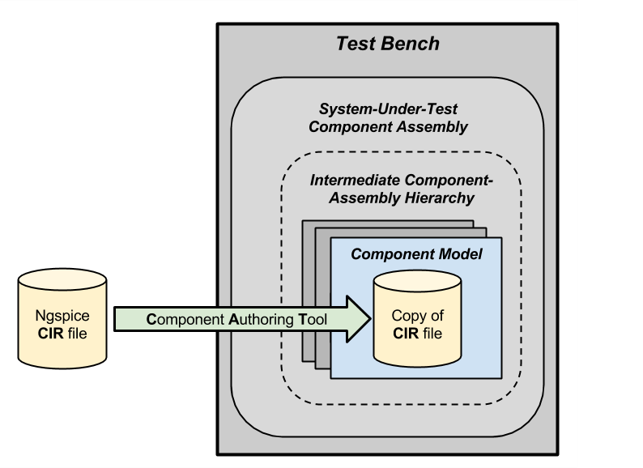
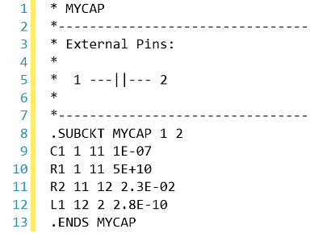
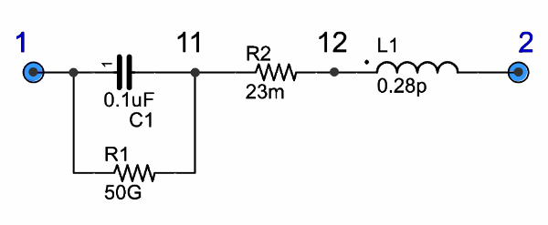
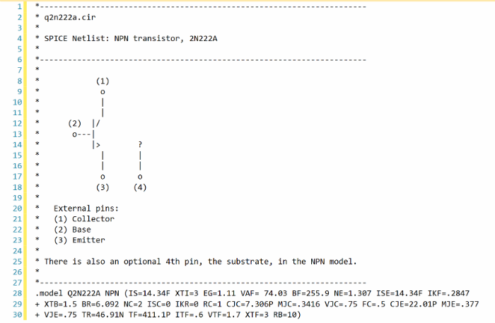
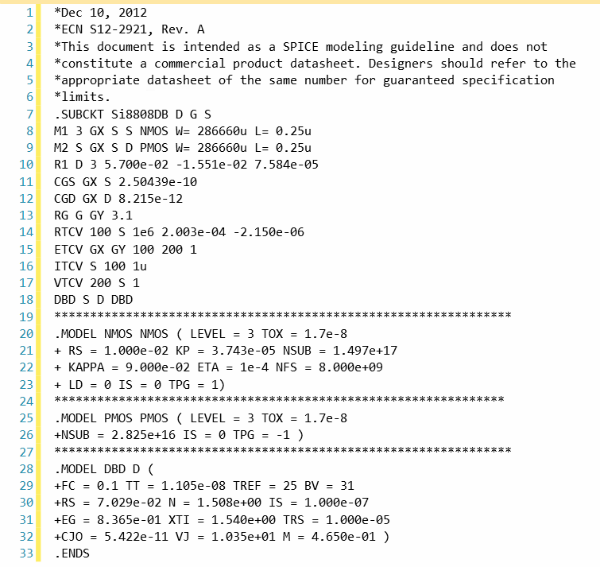
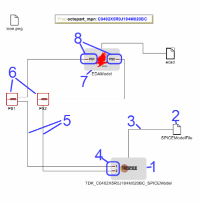

___
## Modeling Guidelines: SPICE

### Introduction to SPICE modeling guidelines

#### Purpose and Scope
The CyPhy modeling environment uses SPICE (Simulation Program With Integrated Circuit Emphasis) model files to
perform electrical simulations of user-defined *component assemblies*.
This subchapter describes how
to obtain SPICE model files for electronic components, and how to add SPICE model files to CyPhy component definitions.
Its
intended audience is mainly ARA module designers who will be adding custom electronic *component models* to the CyPhy modeling environment.

This subchapter doesn't describe how to actually run CyPhy SPICE simulations of component assemblies; for that see *Chapter 10: Ara Test Bench Guide.*

#### How SPICE Models are used by CyPhy

SPICE has evolved into many varieties, some of which are proprietary and encrypt the SPICE model files.
The flavor of SPICE the CyPhy modeling environment uses is an open-source version called "Ngspice" that uses clear-text model files.

The main reference
for Ngspice, the *Ngspice User Manual Version 26plus,* 
is available at: http://ngspice.sourceforge.net/docs/ngspice-manual.pdf

Ngspice model files typically have the file-name extension ".cir", and are
referred to in this subchapter as **CIR** files.  A CIR file is just an ASCII text file, so it can be viewed and edited with text editors.

**Figure 1** helps to explain the progression of SPICE-model information within the CyPhy modeling environment.

 

*Figure 1: Simplified overview of the progression of SPICE-model information*
___

The items in **Figure 1** of most relevance to this subchapter are shaded yellow, green, or blue, and the items of lesser relevance are gray.

The most relevant items are explained as follows:

- On the left is a yellow Ngspice CIR file, that will be used as input to the *Component Authoring Tool (CAT)*.
This CIR file may have been obtained from
a component manufacturer, copied from a library of SPICE model files, or generated by the user based on data-sheet information.
- The green arrow represents the CAT, which is used, among other things, to copy a SPICE model file
into a directory associated with a *Component Model*.  Additional details about using the CAT to add a SPICE model to a component
are described later in a section titled, "Adding a SPICE model using CAT".
- The blue rectangle in **Figure 1.** represents a component model.
- The yellow "Copy of CIR file" in the blue component model represents a copy of the Ngspice CIR file on the left.
This copy was made by the
CAT during component creation, and is physically stored with the blue-component-model's archetype.

The gray items are described briefly below.

- The dark-gray rectangles behind the blue component model represent some number of additional component models.  Some might be references to the
blue component's archetype, and thus share the same CIR file as the blue component.
- The dashed rounded rectangle labeled "Intermediate Component-Assembly Hierarchy" serves as a reminder that there could be
multiple levels of nested component assemblies in the system under test, each of which could contain
multiple component models or other component assemblies.
- The "System Under Test" component assembly represents the top level component assembly of the system being tested.
- The large outer rectangle labeled "Test Bench" represents the CyPhy *test bench* used for SPICE electrical-behavior simulation.

When the *SPICE-model interpreter* is run from the test bench,
it generates a composite CIR file based on the CIR files associated with the component models within the system under test,
based on the CyPhy model's connections. The generated composite CIR file is then run through SPICE, to simulate the system-under-test's electrical behavior.
For details of how to do this, see *Chapter 10: Ara Test Bench Guide.*

Theoretically, if all the SPICE component models in a system have an appropriate CIR file, then this allows the
electrical simulation of the complete system. Otherwise, a more-limited divide-and-conquer strategy may be appropriate.
Practical difficulties modeling a complete design include:
- all components may not have open-source SPICE models available, and
- detailed SPICE models can take a long time to run.

Obtaining or creating SPICE models with the right level of fidelity for a given purpose still requires skill and effort.

### Additional SPICE tools
Users working with CIR files may find the following tools helpful:

- LTspice IV is a proprietary but free SPICE simulator available from Linear Technology, that appears to be
compatible with Ngspice models, that can be downloaded from here: http://www.linear.com/designtools/software/#LTspice
- "NGSPICE Online" is a website that lets you run Ngspice models.
Here's a link: http://www.ngspice.com/

### Where to obtain SPICE models

In general, the best source of SPICE models for a component is the component's manufacturer.  Manufacturers of passive devices and discrete
semiconductors often make open-source SPICE models available that,
with little or no effort, can become Ngspice compatible.
Here's a web page with links to manufacturers' SPICE-model download pages:  http://www.5spice.com/links.htm

If a manufacturer-supplied open-source model is not available, there are still several possibilities, listed in no particular order:
- an open SPICE model for the component, created by someone other than the manufacturer, might be available online,
- a SPICE model for an electrically similar component might be substituted, 
- a simple SPICE model might be approximated from the component's datasheet specs,
- a SPICE model might be developed from measured component characteristics.

### Required and recommended features of CIR files

One convention used by the CyPhy tools while adding CIR files to components is that the first ".SUBCKT" subcircuit or ".MODEL" device model
found in the CIR file will be used as the CyPhy component's SPICE model.  So, CIR files must contain a 
subcircuit or a model.

If you are in doubt about whether to start the non-comment portion of the CIR file with a ".SUBCKT" or a ".MODEL" definition,
use a ".SUBCKT".  It provides more functionality than a ".MODEL" definition, and also better pin-name documentation.

CIR files should not contain multiple ".SUBCKT" statements, since only the first one is recognized.  

Furthermore, only a subset of the full Ngspice language is supported. Specifically, the following Ngspice language constructs
are ***not*** permitted:
1. Subcircuit parameter values consisting of brace expressions.
2. ".PARAMS" and ".FUNC" statements.
3. The following element types, from Table 2.1 on page 46 of the *Ngspice Users Manual Version 26plus*:
 - 'A' -- XSPICE code model
 - 'K' -- Coupled (Mutual) Inductors
 - 'N' -- Numerical device for GSS
 - 'P' -- Coupled multi-conductor line (CPL)
 - 'X' -- Subcircuit

### Sample CIR files

#### A Capacitor using a ".SUBCKT"

 **Figure 2** shows a CIR file for a 0.1uF capacitor in an 01005 package, with its text printed black.
The line numbers on the left are not part of the CIR file, but were just added for reference. 
Lines 1-7 are a comment which would be ignored when parsing the CIR file.
Line 8 is the first ".SUBCKT" statement, and starts the definition of an equivalent circuit
for the capacitor, which extends to the ".ENDS" statement on line 13.

The *Ngspice Users Manual* describes the syntax and semantics of these SPICE statements.
Also, an equivalent circuit for this capacitor model is shown in **Figure 3** below.

 

*Figure 2: Capacitor CIR File*
___

As seen on lines 5 and 8 of **Figure 2**, and shaded blue in **Figure 3**, this capacitor model has two SPICE pins visible outside the subcircuit,
named "1" and "2". 

*Figure 3: Capacitor Equivalent Circuit*
___

The equivalent circuit shown in **Figure 3** includes both an ideal capacitor and three parasitic elements, as follows:
- C1 is the ideal capacitor.
- R1 is the leakage resistance.
- R2 is an equivalent series resistance.
- L1 is the lead inductance.

Other equivalent circuits for this capacitor are also possible, with varying numbers of parasitic elements and degrees of accuracy.  But, exploring
model-accuracy tradeoffs is beyond the scope of this subchapter.

#### A 2N222A using a ".MODEL" statement

A CIR file with a ".MODEL" statement instead of a
".SUBCKT" statement as the first non-comment statement is shown in **Figure 4**.

*Figure 4: CIR file starting with a ".MODEL" statement*
___

Although the comment lines in **Figure 4** give some clues,
the ".MODEL" statement in lines 28-30 doesn't document the component's SPICE pins.
Also, the equivalent circuit described by this CIR file can't be expanded to include other elements,
such as lead inductance, without starting the CIR file with a ".SUBCKT" statement.

#### An Si8808DB N-Channel MOSFET

A CIR file using an initial ".SUBCKT" containing multiple ".MODEL" definitions, is shown in **Figure 5**.
This CIR file models the Vishay Siliconix Si8808DB N-Channel MOSFET.

*Figure 5: A MOSFET CIR file using ".SUBCKT" and ".MODEL" definitions*

Although at first glance **Figure 5** looks like a valid Ngspice file, it is actually for a different variety
of SPICE.  If LTspice IV were used to check this CIR file, it would identify some problems.
For instance, R1 on line 10 of **Figure 5** has multiple position-determined parameter values.  However, Ngspice's resistor
model only has two pin names and a resistance value as positional parameters; other parameters such as
optional temperature coefficients would need to be
indicted by keyword=value pairs.  
___

### Adding a SPICE model using CAT

The best way to add a SPICE model to a CyPhy component
is to use the ***Component Authoring Tool (CAT)***, similar to how it was used previously to add the ***EDAModel***
to the CyPhy component.

#### SPICE-related CAT functions

When a SPICE model file is added to a CyPhy component, the CAT:

- creates a SpiceModel *model* within the component,
- connects the SPICEModelFile resource to the SpiceModel model,
- parses the CIR file to determine what SPICE-model pins it contains,
- adds pins to the SpiceModel model matching the parsed SPICE pins,
- connects the SpiceModel's pins to the component's pins,
- creates a Spice subdirectory for the component,
- copies the CIR file to the component's Spice directory,
- adds a SPICEModelFile *resource* to the component, and
- sets the SPICEModelFile resource's path attribute to link to the copied CIR file.

#### The Canvas after adding a CIR file

**Figure 6** shows a component's canvas after a CIR file has been added to the component via CAT,
with blue numbers added to help identify items of interest.

*Figure 6: Component with SPICE model added*
___

The blue-numbered items shown in **Figure 6** are explained as follows:
1. This is the SpiceModel *model* that CAT added to the component.
2. This is the SPICEModelFile *resource* that CAT added. It contains a path *attribute*
that links to the CIR file.
3. This is the connection between the SPICEModelFile resource and the SpiceModel model.
4. These are the SpiceModel pins.  They are two SchematicModelPort pins that CAT added
to the SpiceModel, based on
two SPICE-model pins CAT found while parsing the CIR file.  The names of these pins come
from the ".SUBCKT" statement of the CIR file; or for CIR files that use an initial model,
the pin names come from a model-based table of default pin names coded within CAT.
5. These are the connections CAT added between the SpiceModel pins and the component pins.
6. These are the component's pins, which correspond to EDAModel pins.  They were created
when the EDAModel was added to the component, prior to adding the SPICE file.
7. This is the EDAModel, which encapsulates schematic and PCB footprint information.
8. These are the pins of the EDAModel.  They were connected to the component's pins prior to
adding the CIR file.

#### Automatic Pin-Name Matching
 
CAT attempts
to automatically connect the SpiceModel pins to the correct component pins, based on comparing the
names of the SPICE pins and the component pins.  This works pretty well as long as the pin names
are reasonably close.  For instance, in **Figure 6**, the SPICEModel pin named "1" was 
connected to component pin named "P$1", and SPICEModel pin "2" was connected to component pin "P$2".

If needed, the user can also manually create or change the pin connections within the CyPhy component model.
For instance, if the circuit designer wanted SPICE pin 1 connected to component pin "P$2", they could
manually make that change.  To avoid the need for this extra step, however, it's best
to choose SPICE pin names that are similar to the component pin names, which unless modified are
the schematic pin names.

To help circuit designers verify that their SPICE pins have automatically been connected correctly,
CAT produces console messages such as:
~~~
Running Component Authoring interpreter. 
Created a new SPICEModel: "TDK_C0402X5R0J104M020BC_SPICEModel" 
Connecting SPICE model pin "1" to component pin "P$1". 
Connecting SPICE model pin "2" to component pin "P$2". 
Copied file "C:\Users\Meta\Desktop\MyComponents\Library\C_01005_0.1uF\spice\C_01005_0.1uF.cir" to 
"C:\Users\Meta\repos\tonkalib\authoring_models\nklabs_ara_proto_board\components\deavgwwp\Spice\C_01005_0.1uF.cir".
~~~
This listing confirms that CAT connected the SPICE pins as shown in item 5 of **Figure 6**.
