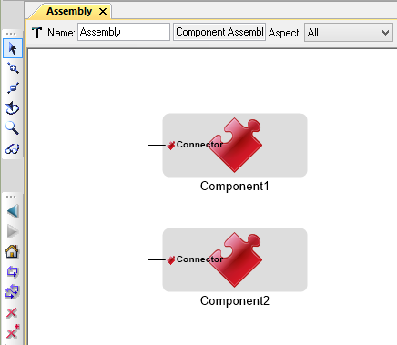
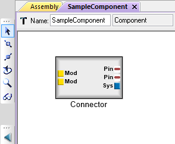
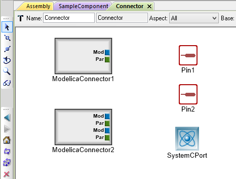
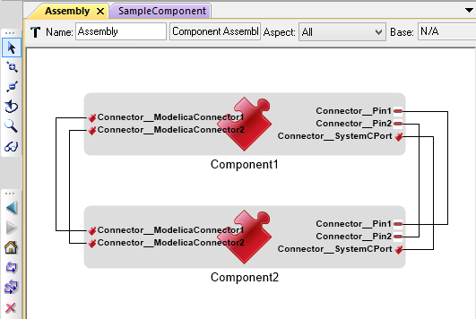
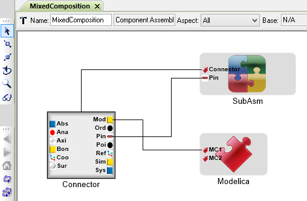
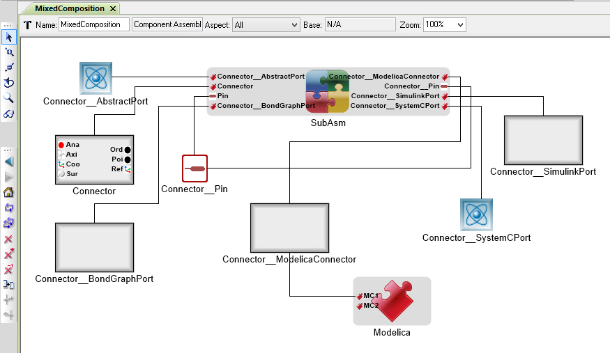
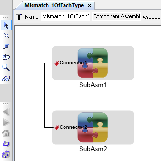
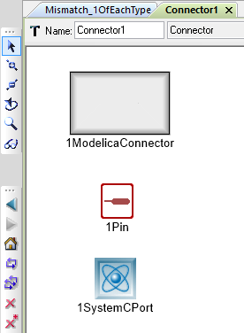
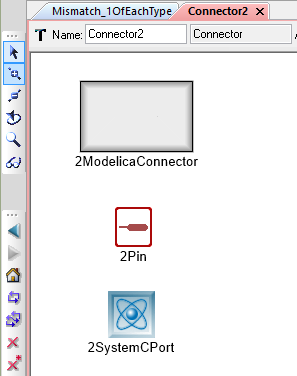
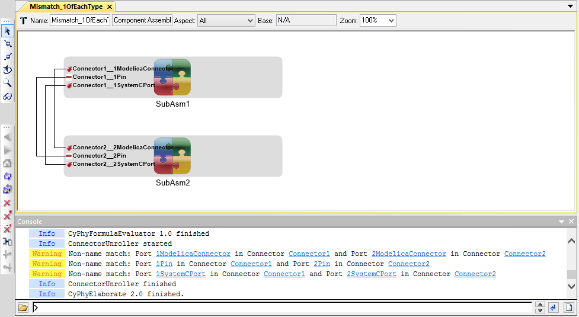

# Chapter 8: Working With Connectors
**Connectors** are a powerful concept for raising the level of abstraction for component composition. Think of them like a _bus_ that  can aggregate multiple **Ports**, each with a **Role**.

## An Example
Consider the following example. In the component assembly ***Assembly***, there are two component instances called ***Component1*** and ***Component2***. They are both instances of ***SampleComponent***. Each has a _connector_ called ***Connector***. They are joined together within the assembly.

If we navigate inside ***SampleComponent***, we can see its connector.

If we navigate inside ***Connector***, we can see the _ports_ that make up its *Roles*. Each *role* is a port of a specific type, and has a unique name. 

In this example, we have:

* A _ModelicaConnector_ with role ***ModelicaConnector1***
* A _ModelicaConnector_ with role ***ModelicaConnector2***
* A _Pin_ with role ***Pin1***
* A _Pin_ with role ***Pin2*** 
* A _SystemCPort_ with role ***SystemCPort***

By aggregating all of these port types into a single _connector_, we're able to connect them to another component all at once. By joining these two connectors, we are "virtually" connecting all the role ports as well.

Effectively, this model is equivalent to the "elaborated" version depicted below, but using only 1 connection instead of 5.

## Mixed Compositions
The top structure is equivalent with the bottom structure. Note that ***Connector*** within the component assembly ***MixedComposition*** is identical to ***Connector*** within ***SubAsm***.

## Exceptional Cases
It's best practice for _connectors_ to be identical on both sides of a _connector composition_. However, the **META** tools will try to resolve ambiguous matches.

### Names of Roles Don't Match
If the name of a role within the first connector doesn't any role names in a second connector, the **META** tools will try to find a match.

1. Within the first connector, is the role the only one of its port type?
	* _e.g.: Is it the only Pin within the first connector?_
	* If not, ***can't match***
2. Does the second connector have a role of the same port type?
	* _e.g.: Does the second connector have a role of type Pin?_
	* If not, ***can't match***
3. Is that role's port type unique within the second connector?
	* _e.g.: Is it the only Pin within the second connector?_
	* If not, ***can't match***
4. If all of the above, ***match the two roles***.

Consider this example. Two _component assemblies_ are composed via ***SubAsm1***'s ***Connector1*** and ***SubAsm2***'s ***Connector2***.

Looking inside each connector, we see that they each have one _role_ of each port type, but their names are different.

 

Since each role's port type is unique within its connector, the **META** tools will try to match up the roles. The equivalent "elaborated" version is depicted below. Note especially the console messages, which tell us that a **non-name match** was established between these ports.

The warning tells us which _roles_ from which _connectors_ were matched due to this inference, instead of by name:

	[Warning] Non-name match: Port 1ModelicaConnector in Connector Connector1 and Port 2ModelicaConnector in Connector Connector2 
	[Warning] Non-name match: Port 1Pin in Connector Connector1 and Port 2Pin in Connector Connector2 
	[Warning] Non-name match: Port 1SystemCPort in Connector Connector1 and Port 2SystemCPort in Connector Connector2 
