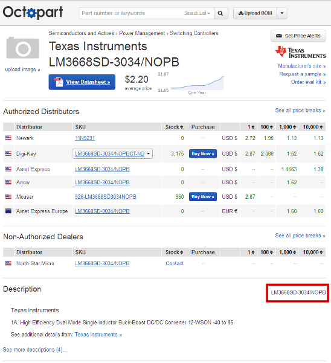
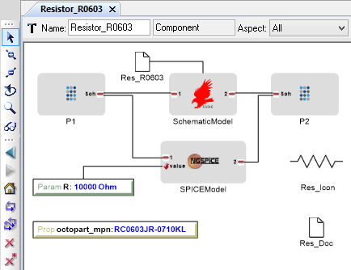

- - -
## Cost Estimation
**Location:** `TestBenches / AraTestBenches / CostEstimation`

This test bench is designed to estimate the cost of parts for a given system design. It polls the [Octopart](http://www.octopart.com) database for up-to-date pricing for each part, looks for the best price break based on the quantity needed, and estimates a parts cost for the design. It also produces a _bill-of-materials (BOM)_ spreadsheet for the design.

*NOTE:* The cost of fabricating the PCB is not included in this analysis. Nor is the cost of assembly. However, these capabilities are planned for a future release.

### Configure
First, you'll need to create a copy of the ***CostEstimation*** test bench. For instructions, refer to the section [Using Test Benches](@ref using-test-benches).

To configure this _test bench_ we need to select the design quantity that will form the basis of the cost estimate. The higher the number of units we plan to build, the better our price breaks should be, and the cost per design should go down.

**To set the design quantity**:

1. Click on the ***design_quantity*** parameter
2. Set the **Value** attribute to be equal to the number of units that should be considered for the estimate

### Metrics
| Name | Unit | Description |
| :--- | ---- | ----------- |
| part_cost_per_design | USD | The cost of the design's parts, based on the specified design quantity, according to the best prices in the Octopart database at the time of execution.

### Outputs
| Filename | Description |
| :-- | :---------- |
| `BomTable.csv` | A _bill-of-materials (BOM)_ table for the design. It includes the cost of each part in the design, as well as the parts-cost-per-unit for the given design quantity.  This _comma-separated value (CSV)_ file can be opened by most spreadsheet programs, including Microsoft Excel, OpenOffice Calc, and Google Docs.

### Assumptions

#### Manufacturer Part Number (MPN)
This analysis will only consider components that have a _Property_ named **octopart_mpn**. This _manufacturer part number (MPN)_ is used to look up the part in the **Octopart** database.

Components that don't have this property will be included in the BOM, but will have no pricing information, and their cost will not be considered in the cost estimate for the design.

**To assign an Octopart MPN to a component:**

1. Find the part on the [Octopart](http://www.octopart.com) website
2. Locate the *MPN* by looking at the value indicated by the **red box** in the image below:
    
3. Create a _Property_ within the _Component_
4. Set the name of the _Property_ to ***octopart_mpn***
5. Set the **Value** attribute of the _Property_ to the MPN found on the Octopart website

An example of a correctly-configured component:

