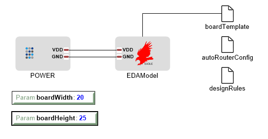
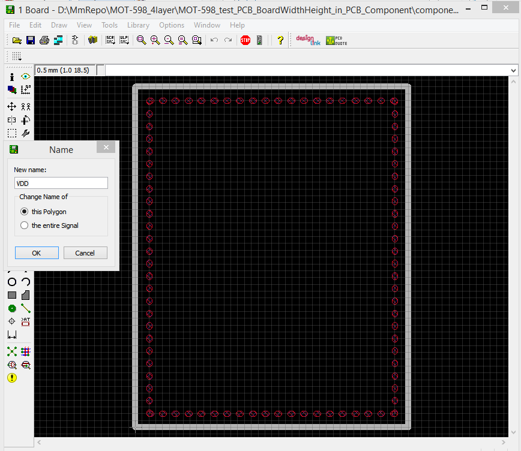

- - -
## Place and Route
**Location:** `TestBenches / AraTestBenches / PlaceAndRoute_1x2`

This test bench is designed to build an EAGLE schematic and board file. It automatically places components according to layout constraints provided in the CyPhy model. It then uses EAGLE's routing engine to automatically route the signals on the board.

The parts in the EAGLE schematic will receive automatically-generated reference designators. The sortable and searchable table provided in **reference_designator_mapping_table.html** can be used to cross-reference these reference designators with the original component paths in the CyPhy model.

### Configure
First, you'll need to create a copy of one of the ***PlaceAndRoute*** test benches. For instructions, refer to the section [Using Test Benches](@ref using-test-benches).

#### PCB Component

The characteristics of the to-be-generated printed circuit board (PCB) are captured in a component representing the PCB.  This component is identified by its ***Classification*** attribute, using the string "pcb_board".  A design should contain no more than one PCB Component.  A peek inside a PCB component defining a 4-layer PCB board is shown below:

If a PCB is to have power layers/regions defined, a connector in the PCB component must be present to define the mapping of CyPhy signals to EagleCAD polygon layers, that typically represent power plane layers/regions in a PCB.  The polygon layers are defined in the ***boardTemplate*** EagleCAD file (see table below).  The EagleCAD net name of the polygon layers is exposed by the pin names in the EDA model as shown in the picture below.  These pin names are explicitly mapped, by connection, to the connector signals.  In this way, the signals in a connector can be mapped to EagleCAD polygon layers representating PCB power planes.

This component may have two parameters as follows:

| Parameter Name | Description | Value Type |
| :------------- | ----------- | ---------- |
| boardWidth | real number | The width (in millimeters) of the area available for components
| boardHeight | real number | The height (in millimeters) of the area available for components

It may also contain the following references to resource files:

| Resource Name    | Description | 
| :------------- | ----------- | 
| boardTemplate    | Path (URI) attribute specifies an EagleCAD *.brd file to be used as a "template" for the PCB 
| autoRouterConfig | Path (URI) attribute specifies an EagleCAD *.ctl file containing EagleCAD router parameters
| designRules      | Path (URI) attribute specifies an EagleCAD *.dru file containing EagleCAD design rule parameters

#### Parameters
The following parameters can be used to customize the board generation process. If you wish to use a parameter that does not already exist in the test bench, you can create a new Parameter object with one of the names below.

This table defines the board generation parameters that, at this time, are *ONLY* supported by specification in the test bench.

| Parameter Name | Description | Value Type |
| :------------- | ----------- | ---------- |
| boardEdgeSpace | string | The minimum distance (in millimeters) between the boundary of a component and the edge of the board
| interChipSpace | string | The minimum distance (in millimeters) between the boundaries of adjacent components

This table defines the board generation parameters that, at this time, are also supported by specification in the test bench overriding any items defined in a PCB Component.

| Parameter Name | Description | Value Type |
| :------------- | ----------- | ---------- |
| boardWidth | real number | The width (in millimeters) of the area available for components
| boardHeight | real number | The height (in millimeters) of the area available for components
| boardTemplate | string | The relative (to the project) path of a PCB board template file
| designRules | string | The relative (to the project) path of a design rule file that specifies place and route guidelines for PCB 
| autorouterConfig | string | The relative (to the project) path of an EAGLE autorouter settings file to be used by the autorouter  

### Outputs
| Filename | Description |
| :------- | :---------- |
| `schema.sch` | The generated EAGLE schematic file.
| `schema.brd` | The generated EAGLE board file, with components placed and signals routed.
| `schema.png` | An image of the placed and routed board.
| `reference_designator_mapping_table.html` | Provides mapping from the auto-generated reference designators in the EAGLE model to the paths of components from the original CyPhy project.

### Detailed Notes
#### Assumptions
This test bench only considers components that have EDA Models (EAGLE Schematics) associated with them. Any components lacking EDA Models are skipped.

#### Design Rules in Board Templates
The generated printed circuit board (PCB) includes the design rules specified using the ***designRules*** parameter. If the ***designRules*** parameter is not provided, then the design rules embedded in the board template are used. If no board template is provided, then the EAGLE's default design rules are used.

The autorouter obeys the design rules rules while building the signal routing for the board.

#### Board Dimensions
If you specify a printed circuit board (PCB) template using the ***boardTemplate*** parameter, its outer geometry is not considered in the layout process. Instead, the placement engine uses the rectangular dimensions given by ***boardWidth*** and ***boardHeight*** when building the layout. The resulting layout is then rendered on the template board. If no board template is specified, then a new PCB is created with the width and height specified.

#### Multi-layer Boards
If you specify both a printed circuit board (PCB) template (using ***boardTemplate***) AND a set of autorouter constraints (using ***autorouterConfig***), be sure that they agree on the number of layers.