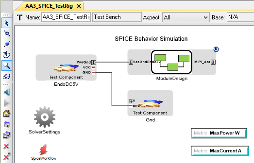

- - -
## SPICE Test
**Location:** `TestBenches / AraTestBenches / SPICETest`

This test bench is designed to provide a simulated 5V power source to a module design. It will construct and execute a SPICE circuit simulation on the system. Once the simulation is complete, the resulting signals may be inspected.

This test bench can also produce metrics of the maximum current and power drawn by the module from the Endo interface.

### Configure
First, you'll need to create a copy of the ***SPICETest*** test bench. For instructions, refer to the section [Using Test Benches](@ref using-test-benches).

The design under test must be connected to the ***PwrGnd*** connector of the ***EndoDC5V*** test component.

_A correctly-configured copy of the <b>SPICEtest</b> test bench, with <b>ModuleDesign</b> as the system under test._

#### Setting Simulation Time
The initial test bench is configured to run for 1 second with a 10us (0.00001s) printing increment. To modify these settings, click on the ***SolverSettings*** and edit its **ToolSpecificAnnotations** attribute. The value of this attribute must be a valid `.TRAN` statement.

> This statement specifies the time interval over which the transient analysis takes place, and the time increments. The format is as follows: 
> 
> `.TRAN TSTEP TSTOP <TSTART <TMAX>> <UIC>`
> 
> - `TSTEP` is the printing increment.
> - `TSTOP` is the final time
> - `TSTART` is the starting time (if omitted, TSTART is assumed to be zero)
> - `TMAX` is the maximum step size.
> - `UIC` stands for Use Initial Condition and instructs PSpice not to do the quiescent operating point before beginning the transient analysis. If UIC is specified, PSpice will use the initial conditions specified in the element statements (see data statement) IC = value.
*from http://www.seas.upenn.edu/~jan/spice/spice.overview.html#Transient*

### Test Components
 ***EndoDC5V*** provides electrical *5V* and *Ground* via the ***PwrGnd*** connector. The design under test must be connected to this connector. This test component also monitors the current and power draw of the module, and uses this information to populate the ***MaxPower*** and ***MaxCurrent*** metrics.

 ***Gnd*** provides an electrical ground reference for the generated SPICE model.

### Metrics
| Name | Unit | Description
| :--- | :--- | :---------
| MaxCurrent | Amperes | The maximum current drawn by the system under test during the simulation.
| MaxPower | Watts | The maximum power drawn by the system under test during the simulation.

### Outputs
| Filename | Description |
| :------- | :---------- |
| `schema.cir` | A SPICE model representing the design
| `schema.raw` | The raw signal data produced by the simulation
| `reference_designator_mapping_table.html` | Provides mapping from the auto-generated reference designators in the EAGLE model to the paths of components from the original CyPhy project.

### Viewing Signals
The signals produced during a simulation can be found in `schema.raw` and can be plotted by a number of waveform viewers. The META tools ship with a copy of **NGSpice**, which can also be used to plot signal data.

To use **NGSpice** to plot signal data:

1. Run `C:\Program Files (x86)\META\bin\spice\bin\ngspice.exe`
2. Use the command `load <path>`, where `<path>` is the full path to your `schema.raw` file
3. NGSpice will list the signals available in the raw data file.
4. Use the command `plot <signal name>` to plot a signal.

For more information on plotting using NGSpice, see http://crpppc19.epfl.ch/doc/ngspice-doc/html/manual.html#toc-Subsection-17.5.40

To cross-reference SPICE device names with elements from your CyPhy model, use `reference_designator_mapping_table.html`

### Assumptions
Only components with associated SPICE models will be included in the generated system model and simulation.