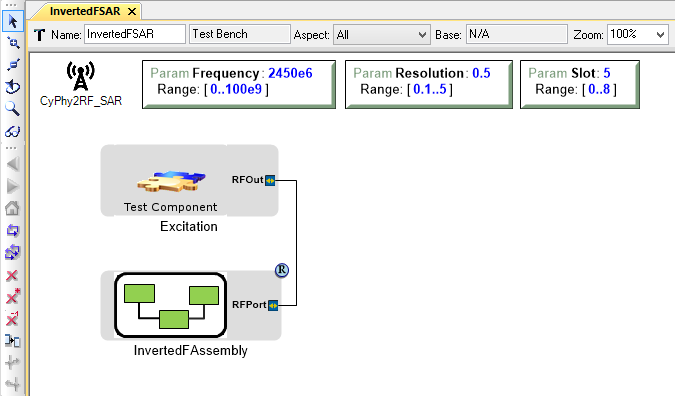

- - -
## RF Analysis
**Location:** `TestBenches / AraTestBenches / RF / *`

There are two separate RF testbenches, named **Directivity** and **SAR**. Both provide excitation for the RF model to be tested, set up the simulation space, then execute OpenEMS and the related post-processing tasks. The **Directivity** testbench is focused on the evaluation of the antenna performance (directivity, S11, ZIN, etc.) with the FDTD simulation space reduced to the size of the Ara endo. The **SAR** testbench, on the other hand, includes model both for an the entire Ara endo and a head phantom, over which the SAR is calculated.

For details on using the RF analysis interpreter, refer to section [CyPhy2RF](@ref cyphy2rf).

### Configure

Create a copy of the **Directivity** of **SAR** testbench. Connect the *Excitation* test component to the RF design under test, see the connection leading to *InvertedFAssembly* in the figure below:

<i>Configured copy of the **RF / SAR** testbench with **InvertedFAssembly** as the system under test.</i>

### Metrics
| Name | Unit | Description
| :--- | :--- | :---------
| Directivity | dBi | The maximum power density the tested antenna radiates in any direction relative to that of an isotropic antenna.
| Maximum SAR | Watts / kg | The maximum SAR value across the head phantom measured with averaging over volumes that contain 1 g tissue.