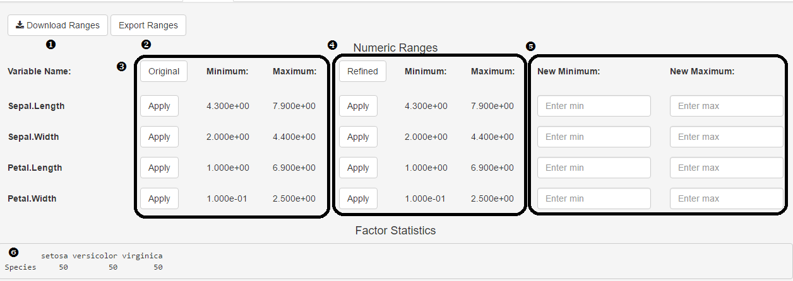

## Ranges

**1. Download Ranges**
This button downloads a .csv file into your ‘Downloads’ folder that contains a replica of the information displayed on the range table.

**2. Export Ranges**
This button downloads a .csv file into the PET’s location that contains a replica of the information displayed on the range table.

**3. Original Numeric Ranges**
This section displays the min and max value, for each variable, before any filtering has been applied.  Clicking ‘Original’ inserts all these value to the New Ranges (whereas clicking 1 apply adds the ‘new’ value for just a single row).

**4. Refined Numeric Ranges**
This section displays the min and max value, for each variable, post-filtering.  Clicking ‘Refined’ inserts all these value to the New Ranges (whereas clicking 1 apply adds the ‘new’ value for just a single row).

**5. New Numeric Ranges**
This section allows a user to set a new min and max value for each variable.  These values will appear in the ‘Export Ranges’ output.

**6. Factor Statistics**
This section displays data on the factor variables in the data set.  Currently, it simply shows a count of each factor.
