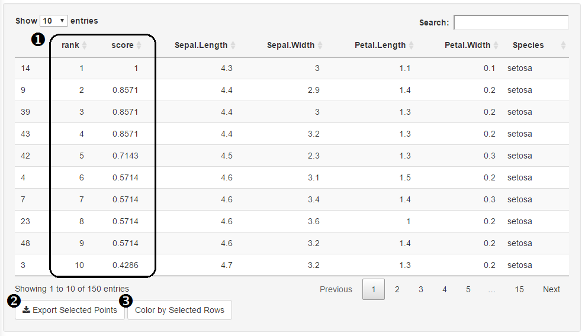
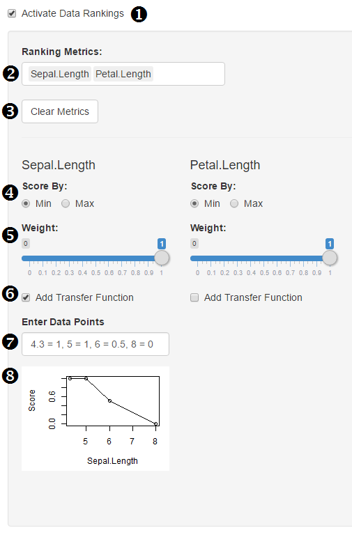

## Data Table

**1. Rank & Score**

These columns appear when data ranking is being used.  The table is sorted by the rank of each data point.  A score between 0 and 1 is assigned to each point based on the data ranking metrics used (see Data Ranking).

**2. Export selected points**

This feature downloads a .csv file to the hard drive containing all the data on selected points.  Points are selected by simply clicking a row.

**3. Color by selected row**

Once rows are selected, this feature will turn the app over to the pairs plot tab and color the chosen data points (color is set in the options tab).

### Data Ranking

**1. Activate Data Rankings**
This checkbox will unveil the ui elements necessary for working with the data ranking system.

**2. Selected Weighted Metrics**
Similar to ‘Display Variables’ in the pairs tab, a user can enter all the variables of which they are interested in scoring.  As variables are added, a suite of ui elements will appear for each variable.  

**3. Clear Metrics**
	Clicking this button resets this tab.

**4. Score By**
	This sets the ranking of a given variable to prioritize high or low values of the dataset. 

**5. Weight**
	This slider sets the relative impact each variable has on the overall rankings.

**6. Add Transfer Function**
When selected, a text box appears where a user can enter their own function for scoring the dataset.

**7. Enter Data Points**
Enter a list of dataset values matched with a score value.  This will create a linear piecewise function that is factored into the overall scoring.  Functions can be defined as PWL(piecewise linear) function with syntax following: x1 =  y1, x2 = y2, ... 

**8. Transfer Function Plot**
This shows a graphical display of the user-defined transfer function.  Scores will be limited to range of 0 to 1 (i.e. values higher than 1 will be converted to a 1 & values below 0 will be converted to 0).
